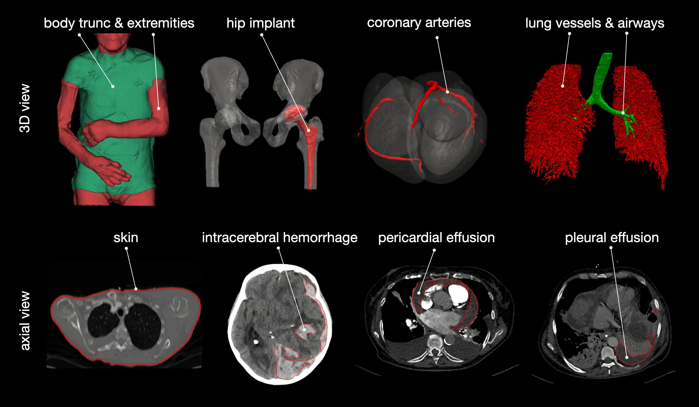
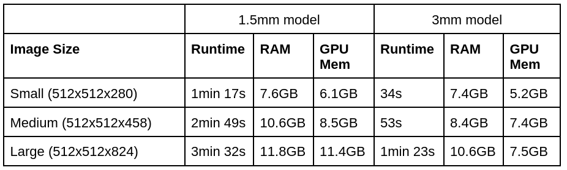

# TotalSegmentator 介绍
**创建时间**：Saturday, February 7, 2026 4:39 PM

TotalSegmentator 是一个基于Pytorch nnUNet 框架的医学图像分割工具，主要用于在 CT 和 MR 图像中进行解剖结构的分割。

## 简介
TotalSegmentator 是一款用于在 CT 或 MR 图像中分割大多数主要解剖结构的工具。该工具在广泛的 CT 和 MR 图像（来自不同扫描仪、机构、协议等）上训练，因此在大多数图像上表现良好。

- Github地址：https://github.com/wasserth/TotalSegmentator
- 训练数据下载
  - CT数据集（1228例）：https://doi.org/10.5281/zenodo.6802613
  - MR数据集（616例）：https://zenodo.org/doi/10.5281/zenodo.11367004
- 在线试用工具：https://totalsegmentator.com/
- 3D Slicer 扩展工具：https://github.com/lassoan/SlicerTotalSegmentator

TotalSegmentator 开发了针对三个特定用途的 Web 应用程序，其主要功能如下：
- 腹部器官体积 (Abdominal organ volume / Volume Report)：https://compute.totalsegmentator.com/volume-report/
  该应用的作用是获取腹部器官的体积，以及组织和骨骼的密度。此外，它还能显示该器官体积在人群中的百分位排名。
- Evans 指数 (Evans index)：https://compute.totalsegmentator.com/evans-index/
  该应用专门用于计算 Evans 指数。在命令行工具中，用户可以通过 totalseg_evans_index 命令在头颅 CT 影像上执行此计算。
  （Evans 指数在临床上通常用于评估脑室扩大情况。）
- 主动脉直径 (Aorta diameter / Aorta Report)：https://compute.totalsegmentator.com/aorta-report/
  该应用旨在分析沿主动脉的直径。这在临床研究中非常有用，例如研究主动脉体积与年龄的正相关性，这种增长通常与动脉瘤的发展有关。

这些工具是 TotalSegmentator 生态系统的一部分，旨在利用其强大的解剖结构分割能力（支持超过 100 个类别）为临床研究和放射学报告提供自动化的定量分析。


TotalSegmentator 支持更多结构，详见子任务获取更多详情：<https://backend.totalsegmentator.com/find-task/>

## （1）安装
TotalSegmentator 支持 Ubuntu、Mac 和 Windows 系统，以及 CPU 和 GPU 运行。

### 先决条件
- Python >= 3.9
- PyTorch >= 2.0.0

### 可选依赖
如果您使用 `--preview` 选项，需要安装 xvfb（`apt-get install xvfb`）和 fury（`pip install fury`）。

### 安装 TotalSegmentator
```bash
pip install TotalSegmentator
```

### 使用方法
#### 针对 CT 图像
```bash
TotalSegmentator -i ct.nii.gz -o segmentations
```
#### 针对 MR 图像
```bash
TotalSegmentator -i mri.nii.gz -o segmentations --task total_mr
```

**注意**：
1. 输入可以是 Nifti 文件，也可以是包含单个患者所有 DICOM 切片的文件夹（或 zip 文件）。
2. 如果在 CPU 上运行，请使用 `--fast` 或 `--roi_subset` 选项以显著提高运行速度。

## （2）子任务
除了默认任务 (total) 外，还有更多包含更多类别的子任务。如果任务名称以 `_mr` 结尾，则适用于 MR 图像，否则适用于 CT 图像。



### 子任务列表（开源部分）
**开源可用（Apache-2.0 许可证）的任何用途：**

| 英文任务名 | 中文描述 | 包含的结构（英文） | 包含的结构（中文） |
| :--- | :--- | :--- | :--- |
| **`total`** | 默认任务，包含 117 个主要类别（类别列表见[此处](#类别详情)） | 117 main classes | 117 个主要类别 |
| **`total_mr`** | MR 图像的默认任务，包含 50 个主要类别（类别列表见[此处](#类别详情)） | 50 main classes on MR images | MR 图像的 50 个主要类别 |
| **`lung_vessels`** | 肺血管（引用[论文](https://www.sciencedirect.com/science/article/pii/S0720048X22001097)）、气管支气管 | lung_vessels, lung_trachea_bronchia | 肺血管、气管支气管 |
| **`body`** | 全身、躯干、四肢、皮肤 | body, body_trunc, body_extremities, skin | 全身、躯干、四肢、皮肤 |
| **`body_mr`** | 躯干、四肢（适用于 MR 图像） | body_trunc, body_extremities (for MR images) | 躯干、四肢（适用于 MR 图像） |
| **`vertebrae_mr`** | 骶骨及所有腰椎（L5-L1）、胸椎（T12-T1）、颈椎（C7-C1）（适用于 MR 图像；在 CT 中此任务包含在 `total` 中） | sacrum, vertebrae_L5, vertebrae_L4, vertebrae_L3, vertebrae_L2, vertebrae_L1, vertebrae_T12, vertebrae_T11, vertebrae_T10, vertebrae_T9, vertebrae_T8, vertebrae_T7, vertebrae_T6, vertebrae_T5, vertebrae_T4, vertebrae_T3, vertebrae_T2, vertebrae_T1, vertebrae_C7, vertebrae_C6, vertebrae_C5, vertebrae_C4, vertebrae_C3, vertebrae_C2, vertebrae_C1 (for CT this is part of the `total` task) | 骶骨、腰椎 L5-L1、胸椎 T12-T1、颈椎 C7-C1（适用于 MR 图像；在 CT 中此任务包含在 `total` 中） |
| **`cerebral_bleed`** | 脑出血（引用[论文](https://www.mdpi.com/2077-0383/12/7/2631)）* | intracerebral_hemorrhage (cite paper)* | 脑出血（引用论文）* |
| **`hip_implant`** | 髋关节植入物* | hip_implant* | 髋关节植入物* |
| **`pleural_pericard_effusion`** | 胸腔积液（引用[论文](http://dx.doi.org/10.1097/RLI.0000000000000869)）、心包积液（引用[论文](http://dx.doi.org/10.3390/diagnostics12051045)）* | pleural_effusion (cite paper), pericardial_effusion (cite paper)* | 胸腔积液、心包积液（均需引用论文）* |
| **`head_glands_cavities`** | 左右眼、左右晶状体、左右视神经、左右腮腺、左右下颌下腺、鼻咽、口咽、喉咽、左右鼻腔、左右耳道、软腭、硬腭（引用[论文](https://www.mdpi.com/2072-6694/16/2/415)） | eye_left, eye_right, eye_lens_left, eye_lens_right, optic_nerve_left, optic_nerve_right, parotid_gland_left, parotid_gland_right, submandibular_gland_right, submandibular_gland_left, nasopharynx, oropharynx, hypopharynx, nasal_cavity_right, nasal_cavity_left, auditory_canal_right, auditory_canal_left, soft_palate, hard_palate (cite paper) | 左眼、右眼、左眼晶状体、右眼晶状体、左视神经、右视神经、左腮腺、右腮腺、右下颌下腺、左下颌下腺、鼻咽、口咽、喉咽、右鼻腔、左鼻腔、右耳道、左耳道、软腭、硬腭（引用论文） |
| **`head_muscles`** | 左右咬肌、左右颞肌、左右翼外肌、左右翼内肌、舌肌、左右二腹肌 | masseter_right, masseter_left, temporalis_right, temporalis_left, lateral_pterygoid_right, lateral_pterygoid_left, medial_pterygoid_right, medial_pterygoid_left, tongue, digastric_right, digastric_left | 右咬肌、左咬肌、右颞肌、左颞肌、右翼外肌、左翼外肌、右翼内肌、左翼内肌、舌肌、右二腹肌、左二腹肌 |
| **`headneck_bones_vessels`** | 喉腔、甲状软骨、舌骨、环状软骨、左右颧弓、左右茎突、左右颈内动脉、左右颈内静脉（引用[论文](https://www.mdpi.com/2072-6694/16/2/415)） | larynx_air, thyroid_cartilage, hyoid, cricoid_cartilage, zygomatic_arch_right, zygomatic_arch_left, styloid_process_right, styloid_process_left, internal_carotid_artery_right, internal_carotid_artery_left, internal_jugular_vein_right, internal_jugular_vein_left (cite paper) | 喉腔、甲状软骨、舌骨、环状软骨、右颧弓、左颧弓、右茎突、左茎突、右颈内动脉、左颈内动脉、右颈内静脉、左颈内静脉（引用论文） |
| **`headneck_muscles`** | 胸锁乳突肌（左右）、咽缩肌（上、中、下）、斜方肌（左右）、颈阔肌（左右）、肩胛提肌（左右）、前中后斜角肌（左右）、胸骨甲状肌（左右）、甲状舌骨肌（左右）、椎前肌（左右）（引用[论文](https://www.mdpi.com/2072-6694/16/2/415)） | sternocleidomastoid_right, sternocleidomastoid_left, superior_pharyngeal_constrictor, middle_pharyngeal_constrictor, inferior_pharyngeal_constrictor, trapezius_right, trapezius_left, platysma_right, platysma_left, levator_scapulae_right, levator_scapulae_left, anterior_scalene_right, anterior_scalene_left, middle_scalene_right, middle_scalene_left, posterior_scalene_right, posterior_scalene_left, sterno_thyroid_right, sterno_thyroid_left, thyrohyoid_right, thyrohyoid_left, prevertebral_right, prevertebral_left (cite paper) | 右胸锁乳突肌、左胸锁乳突肌、上咽缩肌、中咽缩肌、下咽缩肌、右斜方肌、左斜方肌、右颈阔肌、左颈阔肌、右肩胛提肌、左肩胛提肌、右前斜角肌、左前斜角肌、右中斜角肌、左中斜角肌、右后斜角肌、左后斜角肌、右胸骨甲状肌、左胸骨甲状肌、右甲状舌骨肌、左甲状舌骨肌、右椎前肌、左椎前肌（引用论文） |
| **`liver_vessels`** | 肝血管、肝肿瘤（引用[论文](https://arxiv.org/abs/1902.09063)）* | liver_vessels, liver_tumor (cite paper)* | 肝血管、肝肿瘤（引用论文）* |
| **`oculomotor_muscles`** | 颅骨、左右眼球、左右眼外肌群（外直肌、上斜肌、上睑提肌、上直肌、内直肌、下斜肌、下直肌）、左右视神经* | skull, eyeball_right, lateral_rectus_muscle_right, superior_oblique_muscle_right, levator_palpebrae_superioris_right, superior_rectus_muscle_right, medial_rectus_muscle_left, inferior_oblique_muscle_right, inferior_rectus_muscle_right, optic_nerve_left, eyeball_left, lateral_rectus_muscle_left, superior_oblique_muscle_left, levator_palpebrae_superioris_left, superior_rectus_muscle_left, medial_rectus_muscle_right, inferior_oblique_muscle_left, inferior_rectus_muscle_left, optic_nerve_right* | 颅骨、右眼球、右外直肌、右上斜肌、右上睑提肌、右上直肌、左内直肌、右下斜肌、右下直肌、左视神经、左眼球、左外直肌、左上斜肌、左上睑提肌、左上直肌、右内直肌、左下斜肌、左下直肌、右视神经* |
| **`lung_nodules`** | 肺、肺结节（由 BLUEMIND AI 提供：Fitzjalen R., Aladin M., Nanyan G.）（在 1353 例上训练，部分来自 LIDC-IDRI 数据集） | lung, lung_nodules (provided by BLUEMIND AI: Fitzjalen R., Aladin M., Nanyan G.) (trained on 1353 subjects, partly from LIDC-IDRI) | 肺、肺结节（由 BLUEMIND AI 提供，训练数据包含 LIDC-IDRI 数据集中的 1353 例） |
| **`kidney_cysts`** | 左右肾囊肿（相比 `total` 任务中的肾囊肿精度大幅提高） | kidney_cyst_left, kidney_cyst_right (strongly improved accuracy compared to kidney_cysts inside of `total` task) | 左肾囊肿、右肾囊肿（相比 `total` 任务中的肾囊肿精度大幅提高） |
| **`breasts`** | 乳房 | breast | 乳房 |
| **`liver_segments`** | 肝段 1-8（Couinaud 分段）（引用[论文](https://doi.org/10.1007/978-3-030-32692-0_32)）* | liver_segment_1, liver_segment_2, liver_segment_3, liver_segment_4, liver_segment_5, liver_segment_6, liver_segment_7, liver_segment_8 (Couinaud segments) (cite paper)* | 肝段 1-8（Couinaud 分段，引用论文）* |
| **`liver_segments_mr`** | 肝段 1-8（适用于 MR 图像）（Couinaud 分段）* | liver_segment_1, liver_segment_2, liver_segment_3, liver_segment_4, liver_segment_5, liver_segment_6, liver_segment_7, liver_segment_8 (for MR images) (Couinaud segments)* | 肝段 1-8（适用于 MR 图像，Couinaud 分段）* |
| **`craniofacial_structures`** | 下颌骨、下牙、颅骨、头部、上颌窦、额窦、上牙（引用[论文](https://www.ijoms.com/article/S0901-5027(25)01499-7/fulltext)） | mandible, teeth_lower, skull, head, sinus_maxillary, sinus_frontal, teeth_upper (cite paper) | 下颌骨、下牙、颅骨、头部、上颌窦、额窦、上牙（引用论文） |
| **`abdominal_muscles`** | 胸大肌（左右）、腹直肌（左右）、前锯肌（左右）、背阔肌（左右）、斜方肌（左右）、腹外斜肌（左右）、腹内斜肌（左右）、竖脊肌（左右）、横突棘肌（左右）、腰大肌（左右）、腰方肌（左右）（引用[论文](https://doi.org/10.1101/2025.01.13.25319967)，仅分割 T4-L4 范围内的部分）* | pectoralis_major_right, pectoralis_major_left, rectus_abdominis_right, rectus_abdominis_left, serratus_anterior_right, serratus_anterior_left, latissimus_dorsi_right, latissimus_dorsi_left, trapezius_right, trapezius_left, external_oblique_right, external_oblique_left, internal_oblique_right, internal_oblique_left, erector_spinae_right, erector_spinae_left, transversospinalis_right, transversospinalis_left, psoas_major_right, psoas_major_left, quadratus_lumborum_right, quadratus_lumborum_left (cite paper) (only segments within T4-L4)* | 右胸大肌、左胸大肌、右腹直肌、左腹直肌、右前锯肌、左前锯肌、右背阔肌、左背阔肌、右斜方肌、左斜方肌、右腹外斜肌、左腹外斜肌、右腹内斜肌、左腹内斜肌、右竖脊肌、左竖脊肌、右横突棘肌、左横突棘肌、右腰大肌、左腰大肌、右腰方肌、左腰方肌（引用论文，仅分割 T4-L4 范围内的部分）* |
| **`teeth`** | 下颌骨、上颌骨、左右下牙槽神经管、左右上颌窦、咽部、牙桥、牙冠、种植牙及所有单个牙齿（包括牙髓）（基于 ToothFairy3 数据集，引用[论文](https://openaccess.thecvf.com/content/CVPR2025/html/Bolelli_Segmenting_Maxillofacial_Structures_in_CBCT_Volumes_CVPR_2025_paper.html)） | "lower_jawbone", "upper_jawbone", "left_inferior_alveolar_canal", "right_inferior_alveolar_canal", "left_maxillary_sinus", "right_maxillary_sinus", "pharynx", "bridge", "crown", "implant", "upper_right_central_incisor_fdi11", ..., "lower_right_third_molar_pulp_fdi148" (based on the ToothFairy3 dataset, cite paper) | "下颌骨", "上颌骨", "左下牙槽神经管", "右下牙槽神经管", "左上颌窦", "右上颌窦", "咽部", "牙桥", "牙冠", "种植牙", "右上中切牙（FDI11）", ..., "右下第三磨牙牙髓（FDI148）"（基于 ToothFairy3 数据集，引用论文） |
| **`trunk_cavities`** | 腹腔、胸腔、心包、纵隔 | abdominal_cavity, thoracic_cavity, pericardium, mediastinum | 腹腔、胸腔、心包、纵隔 |

**标注**：
\* 表示这些模型未在全量 TotalSegmentator 数据集上训练，而是在其他小型数据集上训练。因此，其鲁棒性可能稍差。

### 子任务列表（需许可证部分）
**需要许可证（非商业用途可在此处获取免费许可证。商业许可证请联系 jakob.wasserthal@usb.ch）：**

| 英文任务名 | 中文描述 | 包含的结构（英文） |
| :--- | :--- | :--- |
| **`heartchambers_highres`** | 心脏腔室高分辨率：心肌、左右心房、左右心室、主动脉、肺动脉（在亚毫米分辨率上训练） | myocardium, atrium_left, ventricle_left, atrium_right, ventricle_right, aorta, pulmonary_artery (trained on sub-millimeter resolution) |
| **`appendicular_bones`** | 四肢骨：髌骨、胫骨、腓骨、跗骨、跖骨、足趾骨、尺骨、桡骨、腕骨、掌骨、手部指骨 | patella, tibia, fibula, tarsal, metatarsal, phalanges_feet, ulna, radius, carpal, metacarpal, phalanges_hand |
| **`appendicular_bones_mr`** | 四肢骨（MR版）：髌骨、胫骨、腓骨、跗骨、跖骨、足趾骨、尺骨、桡骨（适用于 MR 图像） | patella, tibia, fibula, tarsal, metatarsal, phalanges_feet, ulna, radius (for MR images) |
| **`tissue_types`** | 组织类型：皮下脂肪、躯干脂肪、骨骼肌 | subcutaneous_fat, torso_fat, skeletal_muscle |
| **`tissue_types_mr`** | 组织类型（MR版）：皮下脂肪、躯干脂肪、骨骼肌（适用于 MR 图像） | subcutaneous_fat, torso_fat, skeletal_muscle (for MR images) |
| **`tissue_4_types`** | 4种组织类型：皮下脂肪、躯干脂肪、骨骼肌、肌间脂肪（与 tissue_types 不同，将骨骼肌分为肌肉和脂肪两类） | subcutaneous_fat, torso_fat, skeletal_muscle, intermuscular_fat (in contrast to tissue_types skeletal_muscle is split into two classes: muscle and fat) |
| **`brain_structures`** | 脑结构：脑干、蛛网膜下腔、静脉窦、透明隔、小脑、尾状核、豆状核、岛叶皮质、内囊、脑室、中央沟、额叶、顶叶、枕叶、颞叶、丘脑（**注意**：此任务用于 CT 图像）（引用[论文](https://doi.org/10.1148/ryai.2020190183)，我们的模型部分基于此） | brainstem, subarachnoid_space, venous_sinuses, septum_pellucidum, cerebellum, caudate_nucleus, lentiform_nucleus, insular_cortex, internal_capsule, ventricle, central_sulcus, frontal_lobe, parietal_lobe, occipital_lobe, temporal_lobe, thalamus (NOTE: this is for CT) (cite paper as our model is partly based on this) |
| **`vertebrae_body`** | 椎体：所有椎体的椎体部分（不含椎弓）、椎间盘（在 MR 中此任务包含在 `total_mr` 中） | vertebral body of all vertebrae (without the vertebral arch), intervertebral_discs (for MR this is part of the total_mr task) |
| **`face`** | 面部：面部区域（用于匿名化） | face_region (for anonymization) |
| **`face_mr`** | 面部（MR版）：面部区域（用于匿名化） | face_region (for anonymization) |
| **`thigh_shoulder_muscles`** | 大腿与肩部肌肉：左右股四头肌、左右大腿内侧肌群、左右大腿后侧肌群、左右缝匠肌、三角肌、冈上肌、冈下肌、肩胛下肌、喙肱肌、斜方肌、胸小肌、前锯肌、大圆肌、肱三头肌 | quadriceps_femoris_left, quadriceps_femoris_right, thigh_medial_compartment_left, thigh_medial_compartment_right, thigh_posterior_compartment_left, thigh_posterior_compartment_right, sartorius_left, sartorius_right, deltoid, supraspinatus, infraspinatus, subscapularis, coracobrachial, trapezius, pectoralis_minor, serratus_anterior, teres_major, triceps_brachii |
| **`thigh_shoulder_muscles_mr`** | 大腿与肩部肌肉（MR版）：同上类别（适用于 MR 图像） | quadriceps_femoris_left, quadriceps_femoris_right, thigh_medial_compartment_left, thigh_medial_compartment_right, thigh_posterior_compartment_left, thigh_posterior_compartment_right, sartorius_left, sartorius_right, deltoid, supraspinatus, infraspinatus, subscapularis, coracobrachial, trapezius, pectoralis_minor, serratus_anterior, teres_major, triceps_brachii (for MR images) |
| **`coronary_arteries`** | 冠状动脉：冠状动脉（也适用于非增强图像） | coronary_arteries (also works on non-contrast images) |
| **`brain_aneurysm`** | 脑动脉瘤：动脉瘤（仅适用于 TOF MRI 图像；[模型详情](https://doi.org/10.5281/zenodo.17894703)）（CC BY-NC 4.0 许可证，无商业许可证可用）（引用[论文](https://doi.org/10.1007/s10278-025-01533-3)） | aneurysm (only works with TOF MRI images; model details) (CC BY-NC 4.0 license, no commercial license available) (cite paper) |

### 使用语法
```bash
TotalSegmentator -i ct.nii.gz -o segmentations -ta <task_name>
```

对所有结构和任务感到困惑？请查看此页面以搜索可用的结构和任务：<https://backend.totalsegmentator.com/find-task/>
标签 ID 到类别名称的映射关系可在这里找到：<https://github.com/wasserth/TotalSegmentator/blob/master/totalsegmentator/map_to_binary.py>

## （3）高级设置
- `--device`：选择 cpu、gpu 或 gpu:X（例如 gpu:1 对应 cuda:1）
- `--fast`：为加快运行速度并减少内存需求，使用此选项。它将运行较低分辨率模型（3mm 而非 1.5mm）。
- `--roi_subset`：接受一个由空格分隔的类别名称列表（例如 spleen colon brain），仅预测这些类别。可节省大量运行时间和内存。对于小类别（例如前列腺）可能精度稍差。
- `--robust_crop`：对于某些任务和 roi_subset，会使用一个 6mm 低分辨率模型来裁剪感兴趣区域。有时该模型不准确，会导致分割结果被截断等伪影。robust_crop 将使用更好但稍慢的 3mm 模型。
- `--preview`：这将生成所有类别的 3D 渲染图，让您快速查看分割效果及失败位置（见输出目录中的 preview.png）。
- `--ml`：这将保存一个包含所有标签的 Nifti 文件，而不是每个类别一个文件。可节省保存 Nifti 文件时的运行时间（索引到类别名称的映射见此处）。
- `--statistics`：这将生成一个 statistics.json 文件，包含每个类别的体积（单位 mm³）和平均强度。
- `--radiomics`：这将生成一个 statistics_radiomics.json 文件，包含每个类别的放射组学特征。您需要安装 pyradiomics（`pip install pyradiomics`）才能使用此功能。
- `--output_type`：这将输出 DICOM 格式的分割结果。支持 dicom_seg（需要 `pip install highdicom`）和 dicom_rtstruct（需要 `pip install rt_utils`）。

## （4）其他命令
### 预测 CT 图像的对比期相
（需要 `pip install xgboost`），更多详情见此处：<https://github.com/wasserth/TotalSegmentator/blob/master/resources/contrast_phase_prediction.md>
```bash
totalseg_get_phase -i ct.nii.gz -o contrast_phase.json
```

### 预测图像的模态（CT 或 MR）
（需要 `pip install xgboost`）
```bash
totalseg_get_modality -i image.nii.gz -o modality.json
```

### 合并子类别为一个二值掩膜
（例如肺叶合并为整个肺）
```bash
totalseg_combine_masks -i totalsegmentator_output_dir -o combined_mask.nii.gz -m lung
```

### 计算埃文斯指数
```bash
totalseg_evans_index -i ct_skull.nii.gz -o evans_index.json -p evans_index.png
```

### 手动下载权重
通常权重在运行 TotalSegmentator 时会自动下载。如果您想通过额外命令下载权重（例如构建 Docker 容器时），请使用：
```bash
totalseg_download_weights -t <task_name>
```
权重将下载到 ~/.totalsegmentator/nnunet/results。您可以通过设置环境变量更改此路径：`export TOTALSEG_HOME_DIR=/new/path/.totalsegmentator`。如果您的机器无法联网，请在另一台有网络的机器上下载并复制 ~/.totalsegmentator 文件夹到无法联网的机器。

### 设置非开源任务的许可证号
```bash
totalseg_set_license -l aca_12345678910
```

### 输出 softmax 概率
这将生成一个可用 numpy 加载的 .npz 文件。几何信息可能与输入图像不完全相同。还会输出一个包含几何信息的 .pkl 文件。这不适用于 total 任务，因为它基于多个模型。
```bash
TotalSegmentator -i ct.nii.gz -o seg -ta lung_nodules --save_probabilities probs.npz
```

## （5）在无网络访问的机器上运行 TotalSegmentator
1. 在有网络的机器上安装 TotalSegmentator 并[设置许可证]。
2. 在该机器上为一个样本运行 TotalSegmentator。这将下载权重并保存到 ~/.totalsegmentator。
3. 将此机器上的 ~/.totalsegmentator 文件夹复制到无法联网的机器。
4. TotalSegmentator 现在应该也能在无法联网的机器上运行。

## （6）资源需求
TotalSegmentator 有以下运行时间和内存需求（使用 Nvidia RTX 3090 GPU）：
（1.5mm 是正常模型，3mm 是 --fast 模型。在 v2 版本中，由于增加了更多类别，运行时间略有增加。）



### 减少内存消耗的选项
- `--fast`：使用较低分辨率模型
- `--body_seg`：在图像处理前将其裁剪到身体区域
- `--roi_subset <类别列表>`：仅预测类别的子集
- `--force_split`：将图像分割成 3 部分并依次处理。（对于小图像不要使用此选项。将其分割成更小的图像会导致视野过小。）
- `--nr_thr_saving 1`：使用多个线程保存大图像会占用大量内存

## （7）Python API
您可以通过 Python 运行 TotalSegmentator：
```python
import nibabel as nib
from totalsegmentator.python_api import totalsegmentator

if __name__ == "__main__":
    # 方式 1：提供输入和输出文件路径
    totalsegmentator(input_path, output_path)
    
    # 方式 2：提供输入和输出为 nifti 图像对象
    input_img = nib.load(input_path)
    output_img = totalsegmentator(input_img)
    nib.save(output_img, output_path)
```

所有可用参数见此处：<https://github.com/wasserth/TotalSegmentator/blob/master/totalsegmentator/python_api.py>，在主环境中运行可以避免一些多进程问题。

分割图像在扩展头中包含类别名称。如果您想加载这些额外的头信息，可以使用以下代码（需要 `pip install xmltodict`）：
```python
from totalsegmentator.nifti_ext_header import load_multilabel_nifti

segmentation_nifti_img, label_map_dict = load_multilabel_nifti(image_path)
```

---
*编辑于 2026年2月8日*